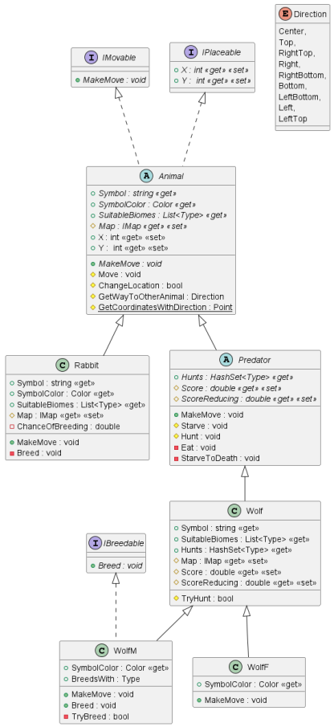

## Опис роботи

Курсова робота з дисципліни "Об'єктно-орієнтоване програмування".

Wolf Island - невелика екологічна модель, яка ставить за мету спостереження за зміною популяції тварин протягом деякого
часу на певній території.
Важливими особливостями моделі є розширюваність та простий, зрозумілий інтерфейс.

## Постановка задачі

Вовчий острів (Ван Тассел Д. Стиль, розробка, ефективність, налагодження й випробування програм. - М.: Мир, 1981).
Вовчий острів розміром 20х20 заселений дикими кроликами, вовками й вовчицями.

Є по кілька представників кожного виду.
Кролики досить нерозумні: у кожний момент часу вони з однаковою ймовірністю 1/9 пересуваються в один з восьми сусідніх
квадратів (за винятком ділянок, обмежених береговою лінією) або просто сидять нерухомо. Кожний кролик з імовірністю 0,2
перетворюється у двох кроликів.

Кожна вовчиця пересувається випадковим чином, поки в одному із сусідніх восьми квадратів
не виявиться кролик, за яким вона полює. Якщо вовчиця й кролик виявляються в одному квадраті, вовчиця з’їдає кролика й
одержує одне очко. А якщо ні, то вона втрачає 0,1 очка. Вовки й вовчиці з нульовою кількістю очків умирають. У
початковий момент часу всі вовки й вовчиці мають 1 очко. Вовк поводиться подібно до вовчиці доти, поки в сусідніх
квадратах не зникнуть усі кролики; тоді, якщо вовчиця перебуває в одному з восьми прилеглих квадратів, вовк женеться за
нею. Якщо вовк і вовчиця виявляться в одному квадраті й там немає кролика, якого потрібно з’їсти, вони роблять потомство
випадкової статі.

Запрограмувати передбачувану екологічну модель і поспостерігати за зміною популяції протягом деякого
періоду часу.

## Графічний інтерфейс

Оскільки програма працює покроково, користувачу надано можливість переходити до наступного кроку за допомогою окремого
елементу управління. Крім того, він може змінювати ландшафт та створювати тварин.

1. Наступний крок
2. Зміна вибраного ландшафту на поле
3. Зміна вибраного ландшафту на океан
4. Випадкова генерація мапи
5. Створення кролика
6. Створення вовка
7. Створення вовчиці

## Діаграми класів

В проєкті широко використовуються абстрактні класи та інтерфейси. Це дозволяє надати більшу гнучкість системі та
легкість горизонтального і вертикального розширення.

### Діаграми класів ландшафту

### Діаграми класів тварин

### Діаграми класів територій

## Приклад роботи програми

### Поширення кроликів по острову

### Полювання вовка

## Додаткові посилання

[Курсова робота](https://drive.google.com/file/d/1OIrnieDCa3ZzQUCHp2ltlayG-QOWSc3B/view?usp=sharing)
